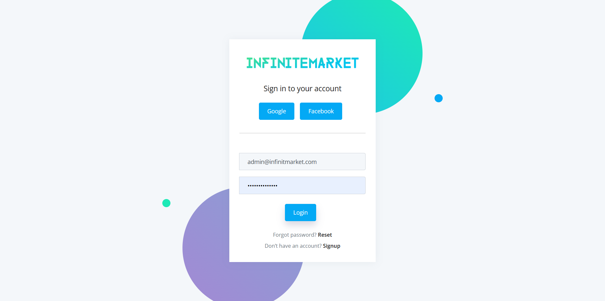
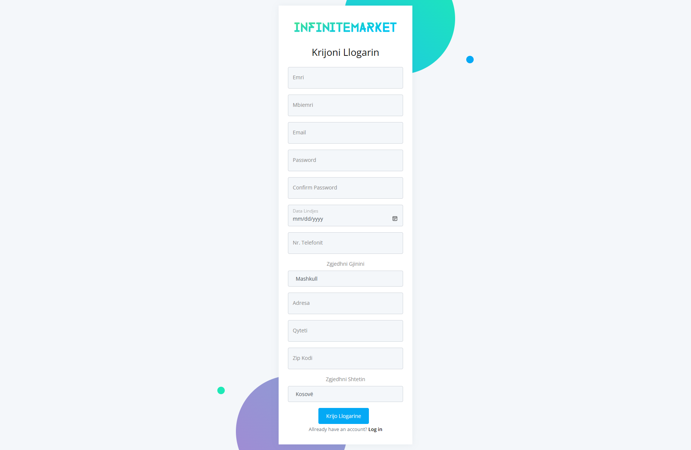
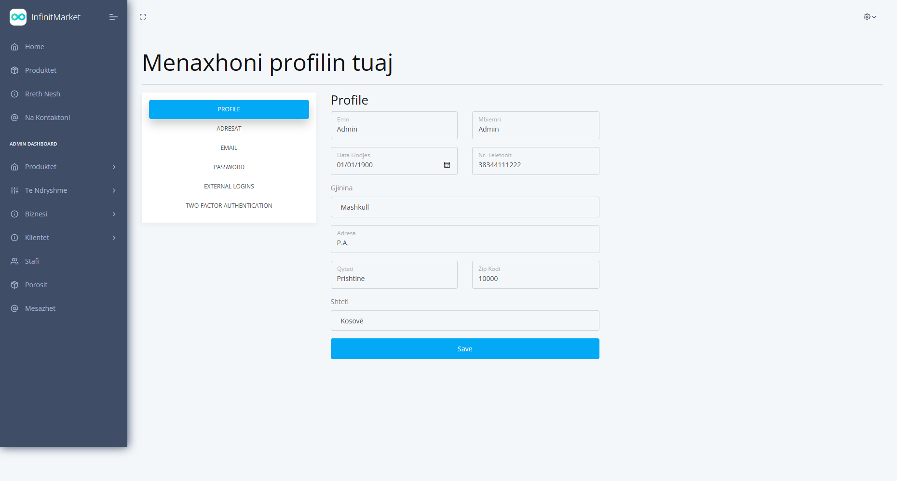
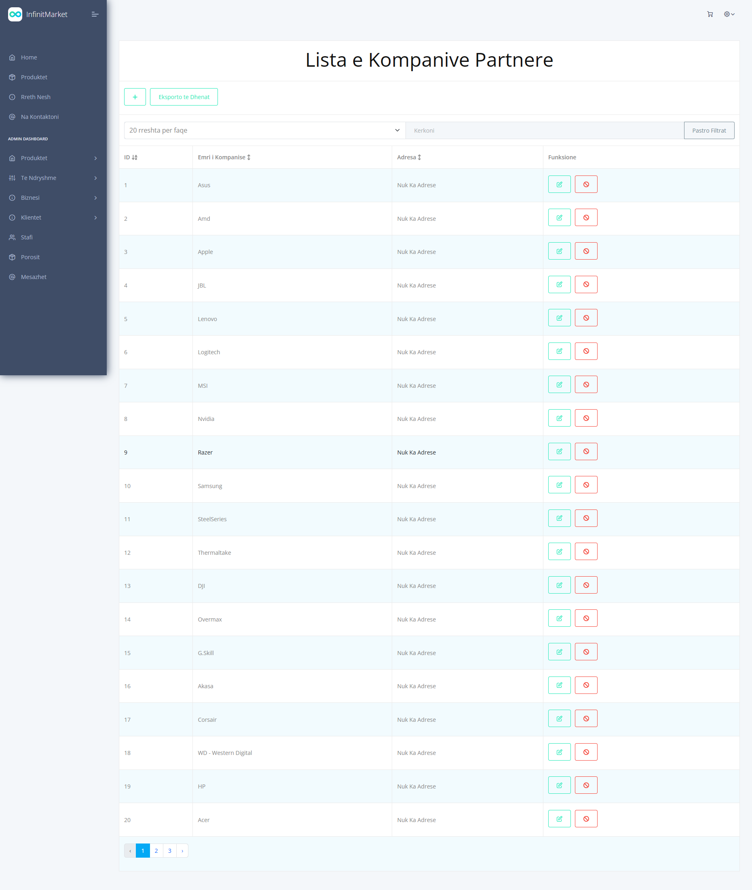
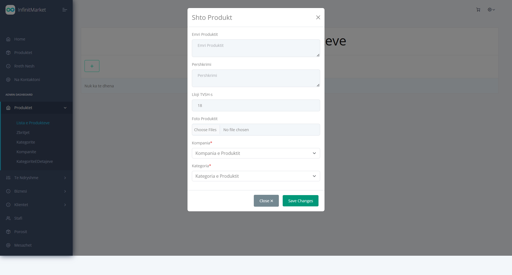
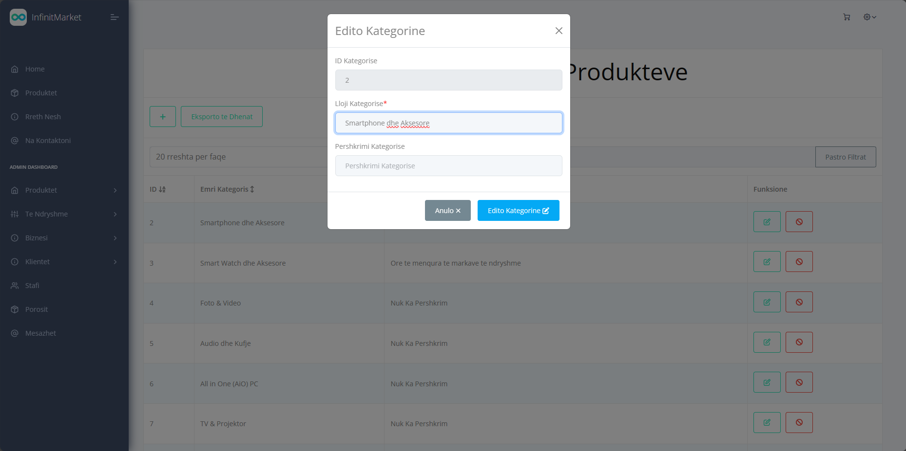
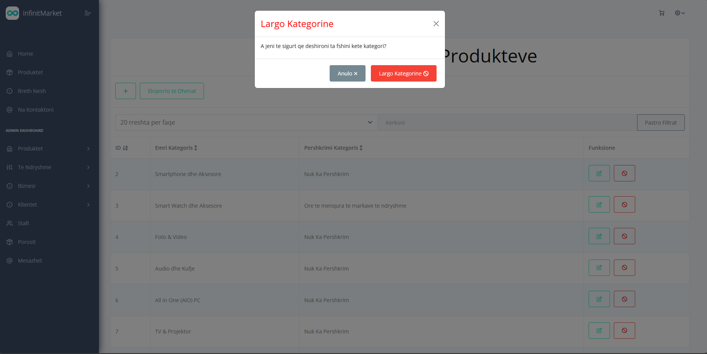

# InfinitMarket - We don't have any limit. We are Infinit

### Logo

Ky projekt eshte punuar per projektin ne **Lab Kurs 2**.

Projekti eshte nje E-commerce i cili ka te beje me shitjen e produkteve te ndryshme teknologjike.

Ky projekt eshte i punuar ne

- **React JS** - Frontend
- **ASP.NET Core Web App (MVC)** - Backend & Frontend
- **MSSQL** – SQLDatabase
- **MongoDB** - NoSQLDatabase

Eshte punuar nga:

- **Rilind Kyçyku** - 212257449 (rk57449@ubt-uni.net)
- **Ilire Jezerci** - 212260094 (ij60094@ubt-uni.net)
- **Fanol Mehmeti** - 212261428 (fm61428@ubt-uni.net)
- **Arbnor Halili** - 212261353 (ah61353@ubt-uni.net)
- **Donat Selmani** - 212258948 (ds58948@ubt-uni.net)

Profesor:

- **Bsc. Elton Boshnjaku**

## Konfigurimi

Se pari duhet te behet konfigurimi i Connection String ne InfinitMarket/appsettings.json dhe duhet te nderrohet emri i Server me ate te serverit tuaj, pastaj ju duhet te beni run komanden **update-database** ne **Serverin e Projektit - InfinitMarket** e cili do te mundesoj gjenerimin ne teresi te databases dhe insertimin e te dhenave bazike, ne rast se deshironi te perdorni te dhenat e InfinitMarket ato mund te i gjeni ne file-in e cila gjendet ne folderin Databaza me emrin **InfinitMarket.sql** kete file duhet ta beni execute ne **SQL Server** pasi qe te keni bere run komanden e cekurme lart ne **Visual Studio**, pasi te keni perfunduar me keto hapa ju duhet qe te beni **run** serverin dhe pastaj ne VSC pjesen e React qe gjendet tek **infinitmarketweb** duhet te hapet ne terminal pastaj duhen te behen run keto komonda:

https://www.youtube.com/watch?v=6KscmgLZFic
https://www.youtube.com/watch?v=N6DC0uQ6c-k

- **npm i** - Bene instalimin automatik te paketave te nevojtura,
- **npm run build** - Bene Build Projektin,
  _Keto duhen te behen vetem ne qoftese e keni hapur projketin per here te pare_
- **npm start** - Bene startimin e projektit (_Kjo duhet te behet gjithmone kur startojme projektin e React_).

Pasi qe te behet konfigurimi ju mund te kyqeni me keto te dhena:

| **Email**                | **Password**   | **Aksesi**                    |
| ------------------------ | -------------- | ----------------------------- |
| admin@infinitmarket.com  | AdminAdmin1@   | Administrator (Akses i Plote) |
| shites@infinitmarket.com | ShitesShites1@ | Shites (Akses i Pjesshem)     |
| klient@infinitmarket.com | KlientKlient1@ | Klient (Akses i thjesht)      |

# Pamja e InfinitMarket

### Login

### Sign Up

### Dashboard

### Tabela

### Forma Shto

### Forma Edito

### Forma Fshij

