# InfinitMarket - We don't have any limit. We are Infinit

### Logo

Ky projekt eshte punuar per projektin ne **Lab Kurs 2**.

Projekti eshte nje E-commerce i cili ka te beje me shitjen e produkteve te ndryshme teknologjike.

Ky projekt eshte i punuar ne

- **React JS** - Frontend
- **ASP.NET Core Web App (MVC)** - Backend & Frontend
- **MSSQL** – SQLDatabase
- **MongoDB** - NoSQLDatabase

Eshte punuar nga:

- **Rilind Kyçyku** - 212257449 (rk57449@ubt-uni.net)
- **Donat Selmani** - 212258948 (ds58948@ubt-uni.net)
- **Ilire Jezerci** - 212260094 (ij60094@ubt-uni.net)
- **Arbnor Halili** - 212261353 (ah61353@ubt-uni.net)
- **Fanol Mehmeti** - 212261428 (fm61428@ubt-uni.net)

Profesor:

- **Bsc. Elton Boshnjaku**

# Informata rreth Funksioneve, Konfigurimit dhe Pamjes

## Funksionet

- Authentikimi behet permes JWToken, sa i perket login eshte perdorur pjesa e MVC per menaxhim dhe qasje me te lehte ne llogari, ku ka si opsiom kyqjen me Google ose Facebook, gjithashtu ofrohet siguria me 2 Factory Authentication.
- **Menaxhimi i Adresave te ndryshme** - Klienti ka mundesi qe te kete me shume se nje adrese te vendosur gje qe e ben me te lehte procesin e porosive pasi qe adresat ruhen ne nje tabele te veqant.
- **Pagesat me Stripe** - Opsioni i Pagesave me Stripe eshte aktiv dhe si i tille mund te perfundohet pagesa duke perdorur kartelat bankare.
- **Lista e Deshirave** - Secili Klient ka mundesin e vendosjes se Produkteve ne Listen e Deshirave.
- **Eksportimi i Te Dhenave** - Eksportimi i te dhenave eshte i mundur ne te gjitha faqet ku gjenden tabela. Eksportimi lejohet ne formate te ndryshme si: Excel, JSON, CSV, Tekst etj.
- **Tabelat** - Secila tabel eshte e konfiguruar ne ate menyre qe te mundesoj filtrimin e te dhenave mbas search, apo te beje renditjen e tyre sipas te gjitha kolonave ne tabel.
- **Fatura** - Secila porosi ka te mundur shfaqjen, ruajtjen dhe printimin e fatures per ate porosi.
- **Barcode dhe QRCode** - Secila fature ka te vendosur Barcode i cili permban numrin e fatures si dhe QRCode me te gjitha te dhenat e Fatures.
- **Statistikat** - Kjo eshte nje faqe e dedikuar vetem per statistikat e Dyqanit e cila ka qasje vetem Roli i Admin, Ne kete faqe gjenden statistika te ndryshme per shtije, produkte dhe klient.
- **Zbritjet e Produktit** - Zbritjet mundesohen per te gjitha produktet dhe mund te vendosen sipas datave te ndryshme.
- **Kodi i Zbritjev** - Kodi i Zbritjeve mundeson qe te krijohet kod i veqant i cili ka ne brendesi te saj qmimin e zbritjes, ky kod mundesohet per zbritje ne te gjithe shporten ose vetem ne produkt te caktuar.
- **Te dhenat e Biznesit** - Ketu mund te vendosen Te dhenat e Biznesit si Emri Biznesit, Numri Unik, TVSH etj., Logo si dhe Infomatat bankare te cilat shfaqen tek pjesa e fatures.
- **Slideri i Ofertave** - Ky slider eshte i vendosur tek pjesa e home i cili sherben per shfaqjen e ofertave te ndryshme ose informatave.
- **Vleresimet e Produktit** - Vendosja e vleresimit mundesohet vetem per ata Klient te cilet e kane blere kete produkt.
- **Gjurmimi** - Te gjitha ndryshimet ne sistem te cilat behen per Shto, Perditeso ose Fshije jane te gjurmuar dhe permbajn ID-n e Stafit, Detajet, si dhe Tabelen dhe ID-n e Entitetit.
- **Atributi isDeleted** - Me kete atribut mundesohet qe gjate largimit se produkteve, kategorive, kompanive etj. nga sistemi ato ne te vertet nuk fshihen por si te tilla mbeten ne databaze por qe nuk shfaqen tek klienti, kjo eshte bere qe te mos kete probleme pas largimit te mos kete probleme ne sistem dhe te mos ndryshohen faturat e statistikat.

## Konfigurimi

Se pari duhet te behet konfigurimi i Connection String ne InfinitMarket/appsettings.json dhe duhet te nderrohet emri i Server me ate te serverit tuaj, pastaj ju duhet te beni run komanden **update-database** ne **Serverin e Projektit - InfinitMarket** e cili do te mundesoj gjenerimin ne teresi te databases dhe insertimin e te dhenave bazike, pasi te keni perfunduar me keto hapa ju duhet qe te beni **run** serverin dhe pastaj ne VSC pjesen e React qe gjendet tek **infinitmarketweb** duhet te hapet ne terminal pastaj duhen te behen run keto komonda:

- **npm i** - Bene instalimin automatik te paketave te nevojtura,
- **npm run build** - Bene Build Projektin,
  _Keto duhen te behen vetem ne qoftese e keni hapur projketin per here te pare_
- **npm start** - Bene startimin e projektit (_Kjo duhet te behet gjithmone kur startojme projektin e React_).

Pasi qe te behet konfigurimi ju mund te kyqeni me keto te dhena:

| **Email**                | **Password**   | **Aksesi**                    |
| ------------------------ | -------------- | ----------------------------- |
| admin@infinitmarket.com  | AdminAdmin1@   | Administrator (Akses i Plote) |
| shites@infinitmarket.com | ShitesShites1@ | Shites (Akses i Pjesshem)     |
| klient@infinitmarket.com | KlientKlient1@ | Klient (Akses i thjesht)      |

## Informata te tjera

Ne rast se deshironi te perdorni te dhenat e InfinitMarket ato mund te i gjeni ne file-in e cila gjendet ne folderin **Databaza** me emrin **InfinitMarket.sql** kete file duhet ta beni execute ne **SQL Server** pasi qe te keni bere konfigurimet paraprake, pastaj duhet te behet gjithashtu Krijim i Databazes ne **MongoDB** si dhe i **Collections**, Emri i databazes ne MongoDB: **InfinitMarketDB**, Emri i Collections: **fotoProduktit, vleresimetEProduktit** pasi te behen krijimet e tyre duhet te behen **import JSON Filet** te cilat gjenden ne folderin e **Databaza** me emrat: **InfinitMarketDB.fotoProduktit.json per fotoProduktit dhe InfinitMarketDB.vleresimetEProduktit.json per vleresimetEProduktit**.

Me posht gjeni dy video per krijim e Databazes dhe Collection ne MongoDB si dhe importimin e te dhenave:

- https://www.youtube.com/watch?v=6KscmgLZFic - Krijimi i Databazes dhe Collection
- https://www.youtube.com/watch?v=N6DC0uQ6c-k - Importimi i Te Dhenave.
- Connection String per MongoDB: **mongodb://localhost:27017**

Password eshte i tille per te gjitha llogarit e tjera pas importimit te InfinitMarket EmriMbiemri1@ - Emri dhe Mbiemri si dhe email mund te gjenden ne Admin Dashboard tek pjesa e Klientit.

[Stripe - Kartelat per Testim](https://docs.stripe.com/testing) - Ketu mund te gjenden te gjitha kartela qe do te mund te i testoni.

Ne rast se deshironi ta perdorni InfinitMarket dhe ta ndryshoni me te dhenat e juaja ju duhet te beni disa ndryshime tek pjesa e Authentikimit me Google e Facebook, si dhe Stripe API si dhe ndryshime ne kod tek pjesa e About Us si dhe e Navigimit ku duhet te ndryshohet logo.

Produktet, Kompanit, Kategorit, Ofertat etj. jane marre nga [Gjirafa50](https://gjirafa50.com)

[Google External Login](https://learn.microsoft.com/en-us/aspnet/core/security/authentication/social/google-logins?view=aspnetcore-6.0) - Krijimi i Kodeve per Google External te cilat duhen te ruhen ne AppSettings ne Asp.Net

[Facebook External Login](https://learn.microsoft.com/en-us/aspnet/core/security/authentication/social/facebook-logins?view=aspnetcore-6.0) - Krijimi i Kodeve per Google External te cilat duhen te ruhen ne AppSettings ne Asp.Net

[Konfigurimi i Stripe](https://docs.stripe.com/) - Shikoni dukemntimin e Stripe per te bere konfigurimin e pagesave me stripe per dyqanin tuaj.

Ne rast se keni paqartesi ose sygjerime kontaktoni me cilin do nga pjestaret e ekipes.

## Pamja e InfinitMarket

### Login

### Sign Up

### Dashboard

### Tabela

### Forma Shto

### Forma Edito

### Forma Fshij

### Contact Us Forma

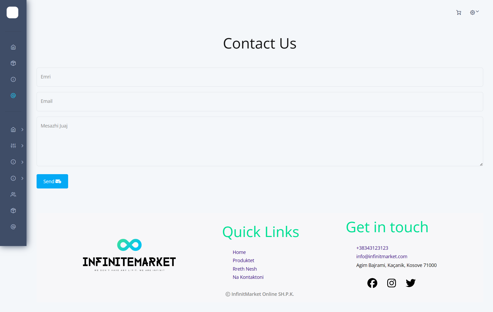

### About Us

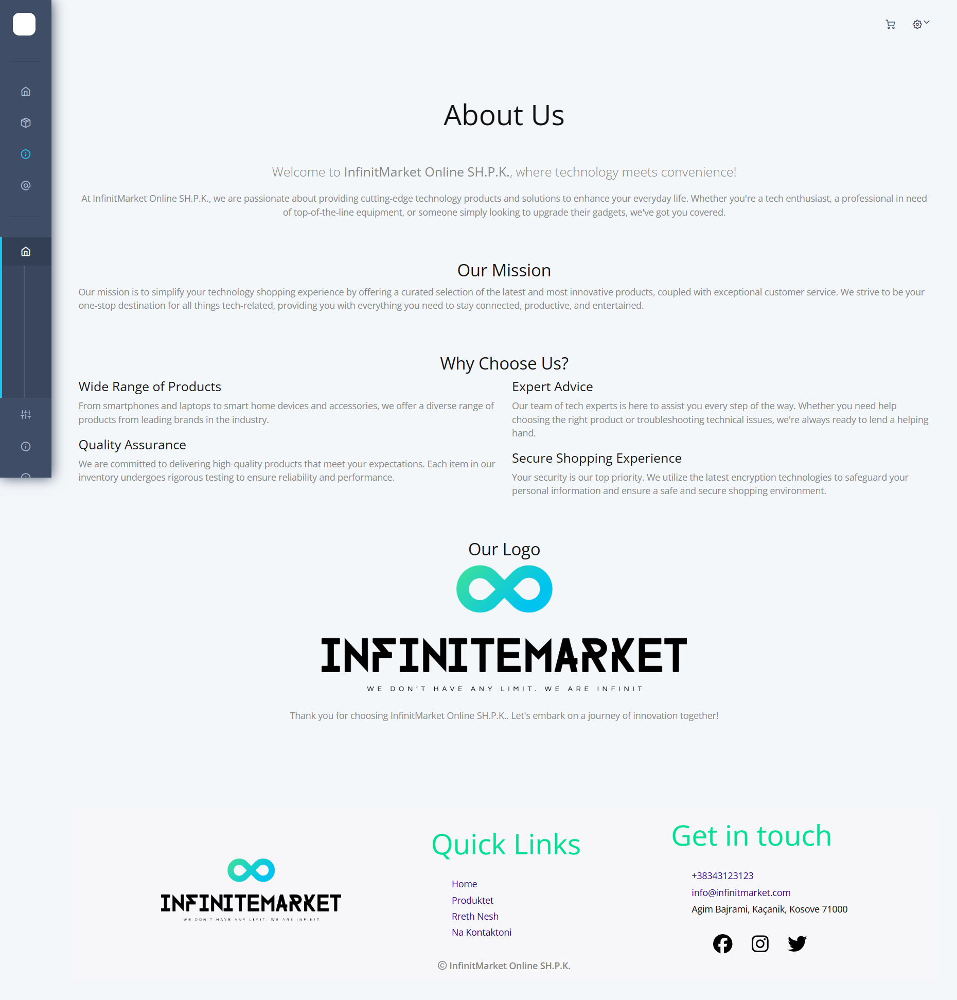

### Shembull Eksportimi i te Dhenave

Ne kete shembull eshte perfshire vetem Excel por ka dhe formate tjera si: JSON, Text, CSV etj.

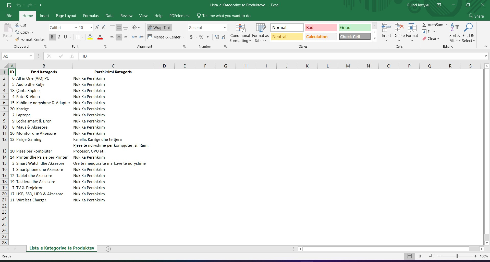

### Produktet

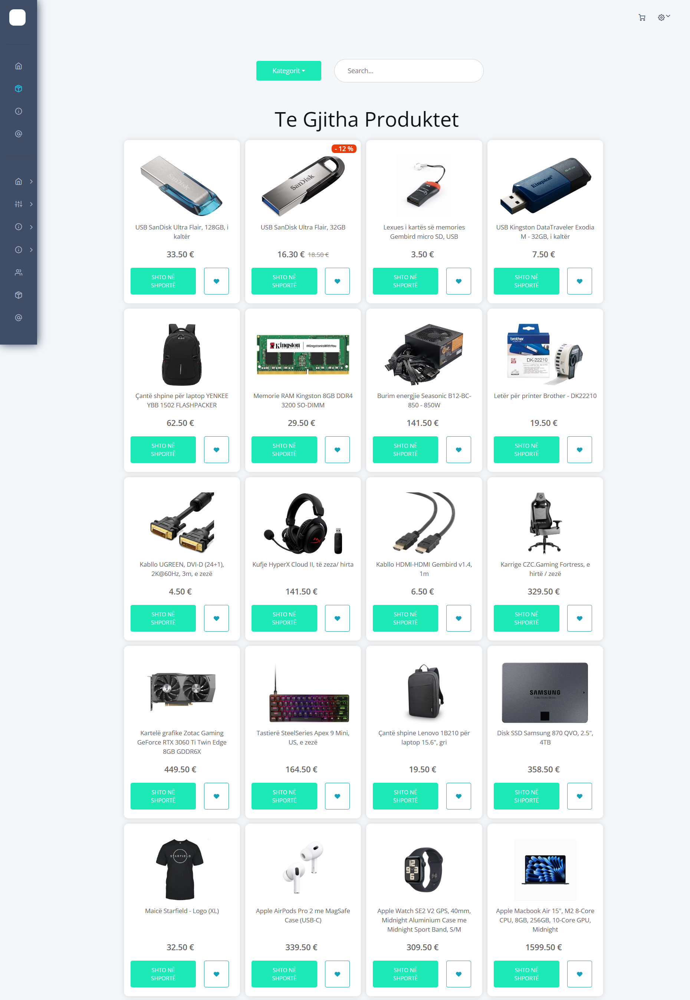

### Faqja Produktit

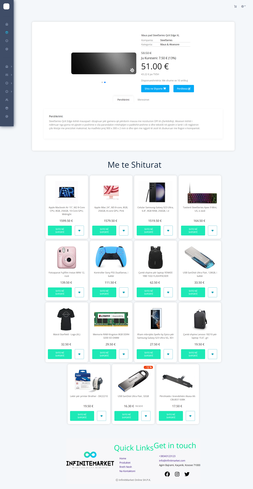

### Fatura

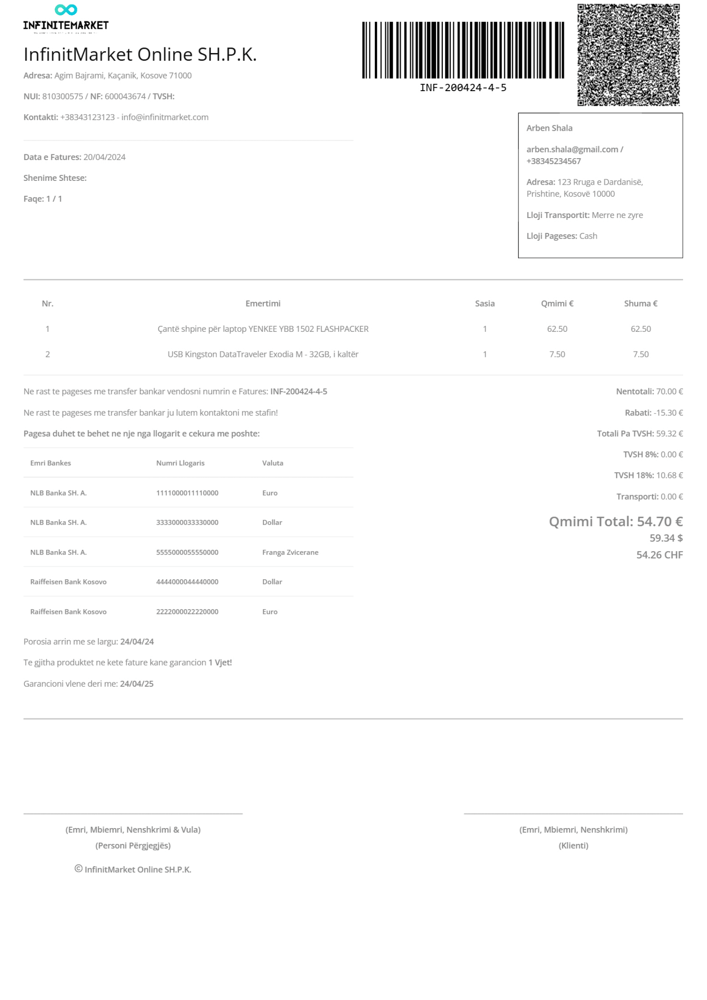

### Lista e Deshirave

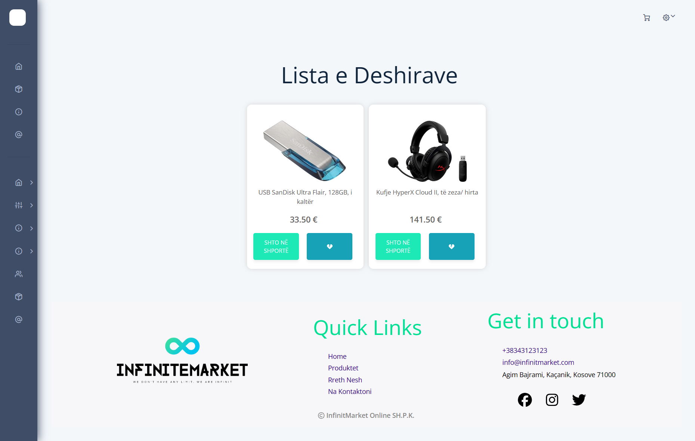

## Shporta

### Shporta

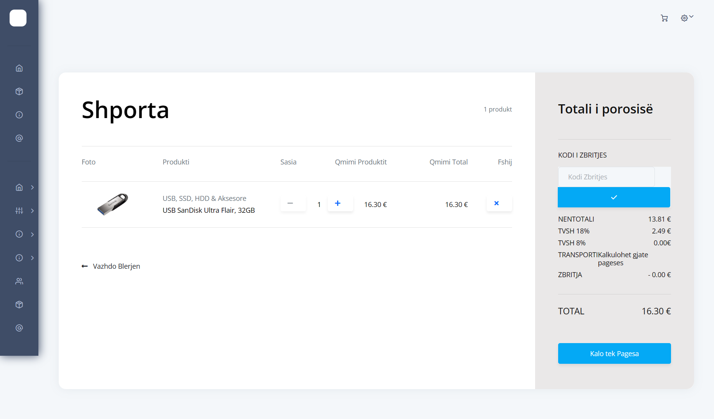

### Konfirmimi Porosis

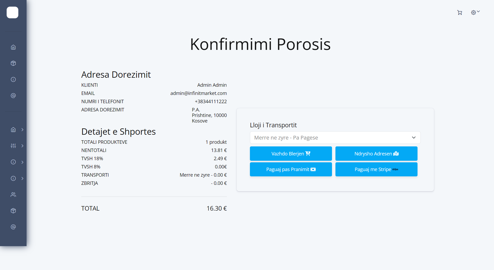

### Pagesa me Stripe

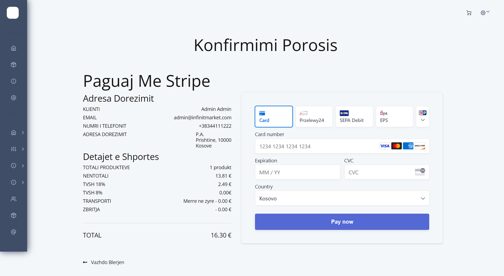

### Pagesa ne Stripe

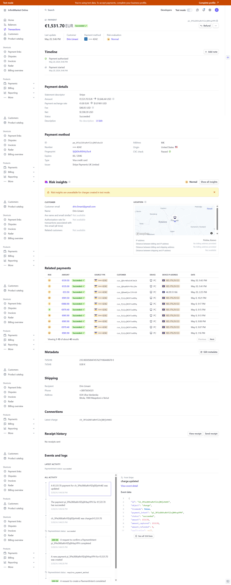

### Porosia e Perfunduar

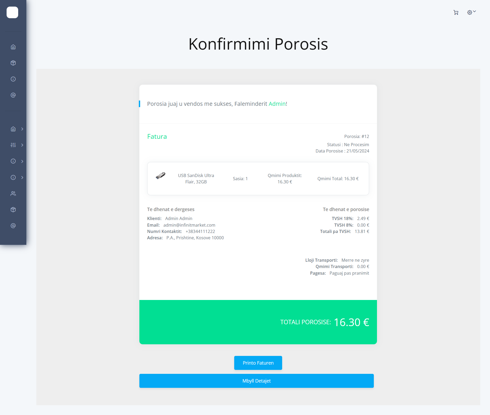
