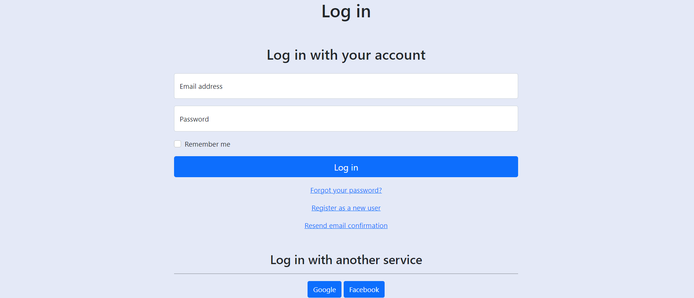
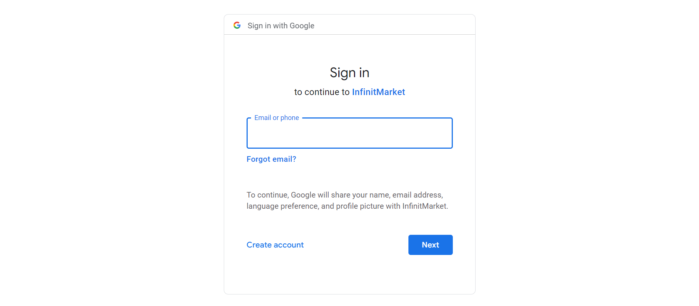
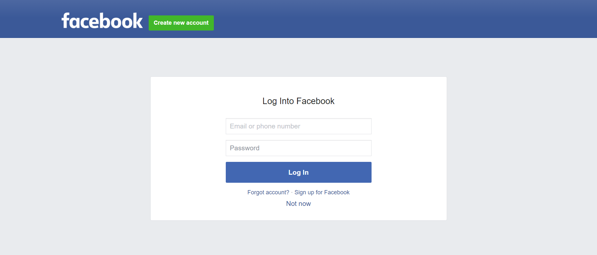

# InfinitMarket-Lab2
We don't have any limit. We are Infinit

### Logo

Ky projekt eshte duke u punuar per projektin ne lenden **Lab Kurs 2**.

Projekti do te jete nje ecommerce i cili ka te beje me shitjen e produkteve te ndryshme, dhe per momentin ka te implementuar google and facebook authentication po ashtu nje register form.

Ky projekt eshte i punuar ne
- **React JS** - Frontend
- **ASP.NET Core Web App (MVC)** - Backend & Frontend
- **MSSQL** – Database

Eshte punuar nga:
- **Rilind Kyçyku** - 212257449 (rk57449@ubt-uni.net)
- **Ilire Jezerci** - 212260094 (ij60094@ubt-uni.net)
- **Fanol Mehmeti** - 212261428 (fm61428@ubt-uni.net)
- **Arbnor Halili** - 212261353 (ah61353@ubt-uni.net)
- **Donat Selmani** - 212258948 (ds58948@ubt-uni.net)

Profesor:
- **Elton Boshnjaku**

# Pamja e InfinitMarket

### Login

### Google Login

### Facebook Login

### Register Page
